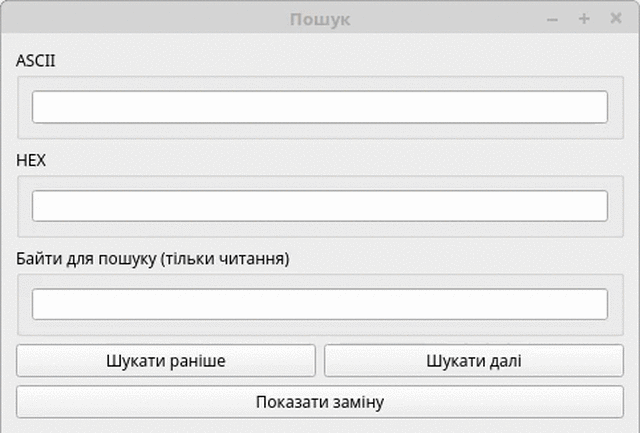

# ProHex - Advanced HEX editor

- **[English](#english)**
- **[Русский](#russian)**
- **[Screenshots/Скриншоты](#screenshots)**

## Small English Section
ProHex is a crossplatform multilanguage modular HEX editor written in C++ and Qt5.

Supported languages:
- English
- Russian
- Ukrainian

Features:
- Create, view and edit binary and text files
- English, Russian and Ukrainian language support
- File analysis (type, size in bytes, additional. information)
- Convertation between 16 numerical representations (Converter module)
- XOR encryption
- Dec, Bin, HEX converter (Converter module)
- ASCII table for system fonts (ASCIITable module)
- View and find ASCII strings in binary files (Strings module)
- Support for Windows, Linux and MacOS
- Find and replace text or bytes in the file (Finder module)
- Modularity (every module is an independent window and can be moved in the different screen)
- Light and dark color schemes
- Calculate MD5 hash of file

## Русская Секция
ProHex - это кроссплатформенный мультиязычный модульный HEX редактор, написанный на C++ с использованием Qt5.

Поддерживаемые языки:
- Анлийский
- Русский
- Украинский

Особенности:
- Создание, просмотр и редактирование бинарных и текстовых файлов
- Доступность на русском, английском и украинском языках
- Анализ файла (тип, размер в байтах, доп. информация)
- Конвертер между 16 числовыми представлениями (модуль Converter)
- XOR шифрование
- Конвертер между двоичной, десятичной и шестнадцатеричной системами числения (модуль Converter)
- ASCII таблица с возможностью выбора шрифта (модуль ASCIITable)
- Просмотр и поиск текстовых данных в бинарных файлах (модуль Strings)
- Поддержка Windows, Linux, MacOS
- Поиск и замена текста или байтов в файле (модуль Finder)
- Модульность (каждый модуль представляет отдельное окно, которое можно вынести на отдельный монитор)
- Светлая и тёмная цветовые схемы
- Вычисление MD5 хеша файла (контрольной суммы)

# Screenshots/Скриншоты

> All modules of ProHex
> Все модули ProHex

> Translations of ProHex
> Переводы ProHex

> Uncommon using of Finder module to convert the string to the byte sequence
> Нестандартное использование модуля Finder для преобразования строки в последовательность байтов

> Uncommon using of Converter module to get symbol code
> Нестандартное использование модуля Converter для получения кода символа

> Uncommon using of ASCIITable module to view installed fonts
> Нестандартное использование модуля ASCIITable просмотра шрифтов

> Search text data in the binary file using Strings module
> Поиск текстовых данных в бинарных файлах с помощью модуля Strings
